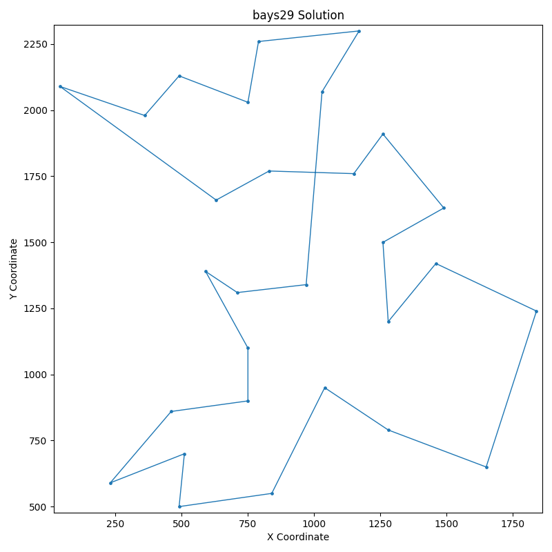
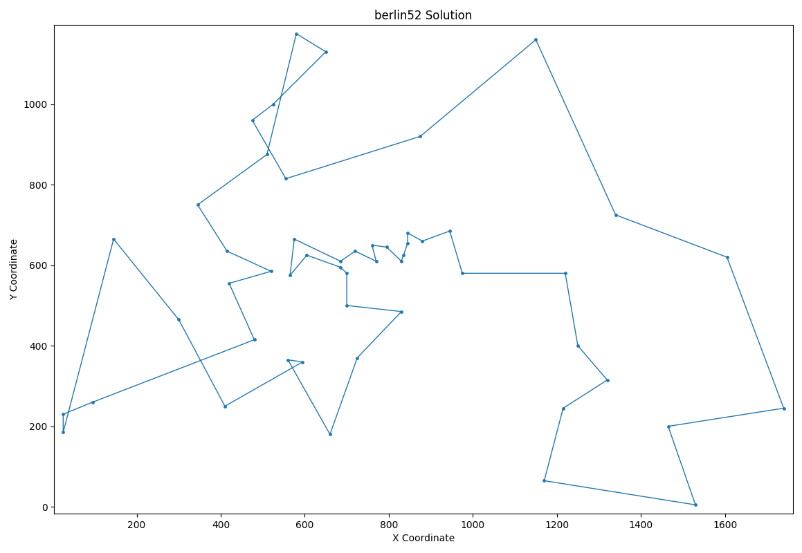
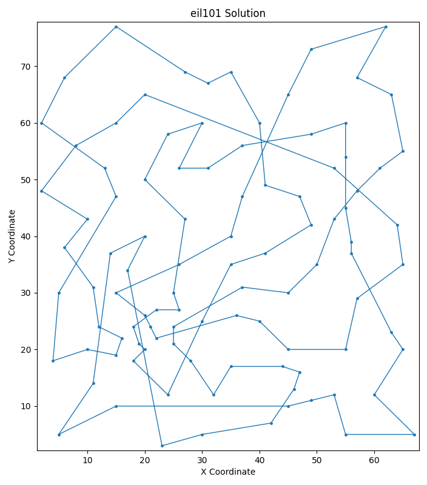
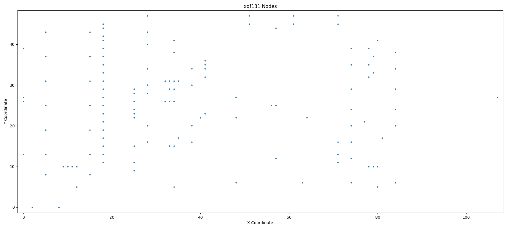
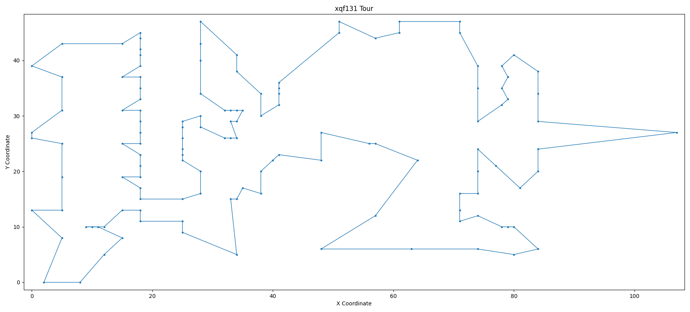
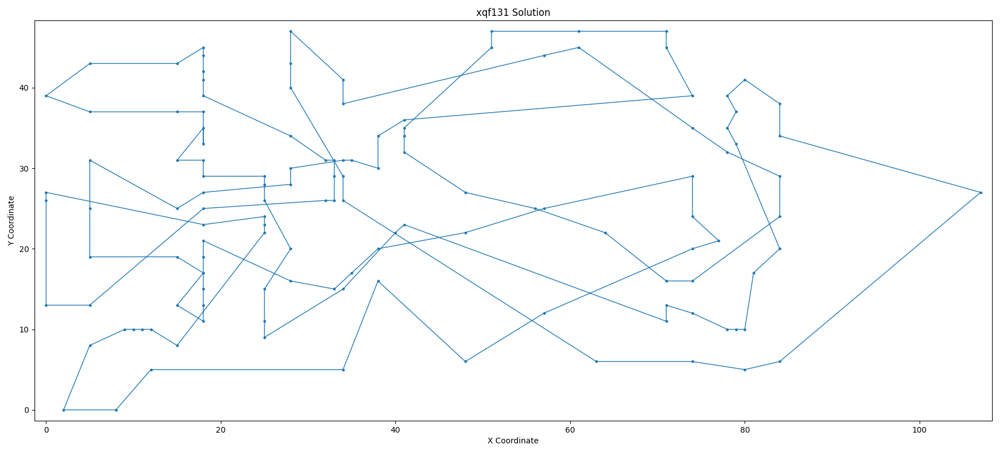

# Przegląd projektu

**Temat:** Rozwiązanie problemu komiwojażera z wykorzystaniem algorytmu genetycznego

**Cele:** 

- Opracowanie bliskiego optimum rozwiązania problemu komiwojażera
- Implementacja algorytmu w Pythonie przy użyciu PyGAD i wizualizacja wyników
- Ocena i walidacja rozwiązania, porównanie z innymi metodami optymalizacji

**Stos technologiczny:** Python [@vanrossum2009python], PyGAD [@gad2023pygad]

# Programowanie i algorytmy genetyczne 

## Programowanie genetyczne

### Programowanie genetyczne, GP (ang. *genetic programming*)

Zautomatyzowana metoda mająca na celu tworzenie programów komputerowych w oparciu o ogólną definicję problemu. Innymi słowy programowanie genetyczne pozwala, w oparciu o wysokopoziomową definicję mówiącą co ma być zrobione, automatycznie stworzyć program, który owo zagadnienie rozwiąże. 

\
Informacje i wskazówki dotyczące programowania genetycznego zaczerpnęliśmy m.in. z [@rutkowski2012metody], [@geeksforgeeks2023genetic] oraz [@analytixlabs2023complete].

## Algorytmy genetyczne

::: columns
:::: {.column width=60%}

Algorytmy genetyczne to rodzaj algorytmów inspirowanych zasadami biologicznej ewolucji, które są wykorzystywane do rozwiązywania problemów optymalizacyjnych i poszukiwania rozwiązań w dużych przestrzeniach stanów. Działają one poprzez symulowanie procesu selekcji naturalnej, krzyżowania i mutacji, co pozwala na tworzenie coraz lepszych rozwiązań.

::::
:::: {.column width=40%}

{width=85%}

::::
:::

---

Proces działania algorytmu genetycznego przedstawia rysunek \ref{fig:alg-gen} oraz może być opisany następująco:

- Inicjalizacja – na początku generuje się populację losowych rozwiązań (nazywanych osobnikami).
- Selekcja – wybiera się najlepsze osobniki na podstawie funkcji oceny, która określa ich jakość.
- Krzyżowanie (Crossover) – łączy się wybrane osobniki, tworząc nowe rozwiązania poprzez wymianę ich "genów".
- Mutacja – wprowadza się drobne, losowe zmiany do potomków, aby zapewnić różnorodność w populacji.
- Ewolucja – proces selekcji, krzyżowania i mutacji powtarza się wielokrotnie, aż do osiągnięcia zadowalającego rozwiązania.

Algorytmy genetyczne są szeroko stosowane w różnych dziedzinach, takich jak optymalizacja logistyczna, projektowanie, uczenie maszynowe, robotyka, a nawet sztuka. Pomimo że mogą wymagać dużej mocy obliczeniowej, są w stanie znaleźć dobre przybliżenia do rozwiązań nawet dla bardzo skomplikowanych problemów.

# Problem komiwojażera

### Problem komiwojażera (ang. Travelling Salesman Problem, TSP) 

Klasyczny problem optymalizacyjny, który polega na znalezieniu najkrótszej możliwej trasy, jaką musi pokonać komiwojażer (sprzedawca), aby odwiedzić każde z zadanych miast dokładnie raz i wrócić do punktu początkowego.

Formalnie, mając dany zbiór miast oraz odległości między każdą parą miast, należy wyznaczyć najkrótszy cykl Hamiltona w grafie, który reprezentuje połączenia między miastami. Przykładowe rozwiązanie prezentuje rysunek \ref{fig:komi-sample}. Problem komiwojażera jest zaliczany do klasy problemów NP-trudnych, co oznacza, że dla dużych zbiorów miast jego dokładne rozwiązanie staje się bardzo czasochłonne.

---

::: columns
:::: {.column width=60%}

**Zastosowanie**

Problem ten znajduje zastosowanie m.in. w logistyce, planowaniu tras transportowych i optymalizacji procesów produkcyjnych. Do jego rozwiązywania stosuje się różne podejścia, w tym algorytmy dokładne, przybliżone oraz heurystyczne, takie jak algorytmy genetyczne czy symulowane wyżarzanie.

::::
:::: {.column width=40%}

{width=85%}

::::
:::

# Kamień milowy 1 - Pierwsza wersja projektu

W ramach pierwszego kamienia milowego zaimplementowaliśmy algorytm genetyczny w Pythonie przy użyciu biblioteki PyGAD.

Algorytm genetyczny został zastosowany do rozwiązania problemu komiwojażera dla 2 zestawów miast o zadanych współrzędnych.

Dla porównania wyników zaimplementowaliśmy również algorytm zachłanny [@geeksforgeeks2023tsp].

Porównanie rozwiązań prezentuje tabela \ref{tab:results}.

## Zestaw prosty - 6 miast

Rysunek \ref{fig:sol-easy-input} przedstawia dane wejściowe zestawu prostego, a rysunek \ref{fig:sol-easy-gt} poprawne rozwiązanie tego zestawu. Rozwiązanie uzyskane za pomocą algorytmu genetycznego prezentuje rysunek \ref{fig:sol-easy-output}.

### Rozwiązanie

- **TSP**: easy
- **Cities**: 6
- **Edge weight type**: EUC_2D
- **Best distance**: 12.17008732545826
- **Best solution**: [0 1 2 3 4 5]
- **Execution time**: 0.0719 seconds

---

--- 

---

## Zestaw xqf131 - 131 miast

Rysunek \ref{fig:sol-xqf131-input} przedstawia dane wejściowe zestawu xqf131, a rysunek \ref{fig:sol-xqf131-gt} poprawne rozwiązanie tego zestawu. Rozwiązanie uzyskane za pomocą algorytmu genetycznego prezentuje rysunek \ref{fig:sol-xqf131-output}.

- **TSP**: xqf131
- **Cities**: 131
- **Edge weight type**: EUC_2D
- **Best distance**: 1475.3859107381754
- **Best solution**: [  0   1   2   3   4   5   6   7   8   9  10  11  12  13  14  15  16  17 18  19  20  21  22  23  24  25  26  27  28  29  30  31  32  33  34  35 59  37  38  39  40  41  42  43  44  45  46  47  48  49  50  51  52  53 54  55  56  57  58  36  60  61  62  63  64  65  66  67  68  69  70  71 72  73  74  75  76  77  78  79  80  81  82  83  84  85  86  87  88  89 90  91 102  93  94  95  96  97  98  99 100 101  92 103 104 105 106 107 108 109 110 111 112 113 114 115 116 117 118 119 120 121 122 123 124 125 126 127 128 129 130]
- **Execution time**: 1.7319 seconds

---

--- 

---

## Porównanie wyników

Tabela \ref{tab:results}: Porównanie wyników \label{tab:results}

| Zestaw (ilość miast)  | Rozwiązanie      | Odległość  | Czas wykonania [s]    |
|-----------------------|------------------|------------|-----------------------|
| Prosty (6)            | Optymalne        | 12.17      | -                     |
| Prosty (6)            | Alg. Zachłanny   | 12.17      | 0.0003                |
| Prosty (6)            | Alg. Genetyczny  | 12.17      | 0.0719                |
| xqf131 (131)          | Optymalne        | 564        | -                     |
| xqf131 (131)          | Alg. Zachłanny   | *          | *                     |
| xqf131 (131)          | Alg. Genetyczny  | 1475.39    | 1.7319                |

\* algorytm nie zwrócił wyniku w ciągu 10 godzin

## Wnioski

- Dla zestawu prostego uzyskaliśmy wynik identyczny z algorytmem zachłannym, co oznacza, że algorytm genetyczny znalazł optymalne rozwiązanie. Stało się to jednak kosztem czasu wykonania, który był znacznie dłuższy.
- Dla zestawu xqf131 uzyskaliśmy wynik gorszy od optymalnego, ale w odróżnieniu od algorytmu zachłannego, algorytm genetyczny był w stanie znaleźć rozwiązanie w rozsądnym czasie.

**Wyniki pokazują, że algorytm genetyczny jest w stanie znaleźć dobre przybliżenia dla problemów optymalizacyjnych, które są trudne do rozwiązania za pomocą innych metod.**

<!-- ## Dalsza praca

- Wykonanie eksperymentów dla większych zestawów miast. -->

# Kamień milowy 2 - finalna wersja projektu

W ramach drugiego kamienia milowego zaimplementowaliśmy własną wersję algorytmu genetycznego w Pythonie, zamiast korzystania z biblioteki PyGAD. Nasza decyzja wynikała z chęci zrozumienia działania algorytmu genetycznego na poziomie implementacji oraz z możliwością dostosowania go do naszych potrzeb.

## Własna biblioteka

- Implementacja ładowania danych z plików TSP
- Implementacja algorytmu genetycznego
- Implementacja następujących operatorów genetycznych:
  - **Selekcja elitarna**
  - **Selekcja turniejowa**
  - **Selekcja ruletkowa**
  - **Krzyżowanie PMX**
  - **Krzyżowanie rekomibinacyjne (ang. recombination)**
  - **Mutacja każdego genu z prawdopodobieństwem $p_m$**
  - **Mutacja przez przesunięcie (ang. displacement)**
  - **Mutacja "losowa mutacja"**
- Implementacja funkcji oceny jakości rozwiązania
- Implementacja mechanizmu zatrzymywania algorytmu po określonej liczbie iteracji bez poprawy wyniku
- Implementacja mechanizmu zmiany parametrów algorytmu w trakcie jego działania
- Implementacja dywersyfikacji populacji
- Implementacja wizualizacji wyników
- Implementacja zapisywania wyników do plików

## Testy i walidacja

W celu oceny i walidacji rozwiązania przeprowadziliśmy testy dla zestawów miast o różnych rozmiarach:

- `easy` - 6 miast, źródło: własne
- `bays29` - 29 miast, źródło: [@tsplib]
- `berlin52` - 52 miast, źródło: [@tsplib]
- `eil101` - 101 miast,  źródło: [@tsplib]
- `xqf131` - 131 miast, źródło: [@vlsiData]

Porównanie rozwiązań prezentuje tabela \ref{tab:results-full}.

---

### Zestaw prosty - 6 miast

Rysunek \ref{fig:sol-easy-input-2} przedstawia dane wejściowe zestawu `easy`, a rysunek \ref{fig:sol-easy-gt-2} poprawne rozwiązanie tego zestawu. Rozwiązanie uzyskane za pomocą algorytmu genetycznego prezentuje rysunek \ref{fig:sol-easy-output-2}.

---

{height=80%}

--- 

{height=80%}

---

{height=80%}

---

### Zestaw bays29 - 29 miast

Rysunek \ref{fig:sol-bays29-input} przedstawia dane wejściowe zestawu `bays29`, a rysunek \ref{fig:sol-bays29-gt} poprawne rozwiązanie tego zestawu. Rozwiązanie uzyskane za pomocą algorytmu genetycznego prezentuje rysunek \ref{fig:sol-bays29-output}.

---

{height=80%}

---

{height=80%}

---

{height=80%}

---

### Zestaw berlin52 - 52 miast

Rysunek \ref{fig:sol-berlin52-input} przedstawia dane wejściowe zestawu `berlin52`, a rysunek \ref{fig:sol-berlin52-gt} poprawne rozwiązanie tego zestawu. Rozwiązanie uzyskane za pomocą algorytmu genetycznego prezentuje rysunek \ref{fig:sol-berlin52-output}.

---

{height=80%}

---

{height=80%}

---

{height=80%}

---

### Zestaw eil101 - 101 miast

Rysunek \ref{fig:sol-eil101-input} przedstawia dane wejściowe zestawu `eil101`, a rysunek \ref{fig:sol-eil101-gt} poprawne rozwiązanie tego zestawu. Rozwiązanie uzyskane za pomocą algorytmu genetycznego prezentuje rysunek \ref{fig:sol-eil101-output}.

---

{height=80%}

---

{height=80%}

---

{height=80%}

---

### Zestaw xqf131 - 131 miast

Rysunek \ref{fig:sol-xqf131-input-2} przedstawia dane wejściowe zestawu `xqf131`, a rysunek \ref{fig:sol-xqf131-gt-2} poprawne rozwiązanie tego zestawu. Rozwiązanie uzyskane za pomocą algorytmu genetycznego prezentuje rysunek \ref{fig:sol-xqf131-output-2}.

---

{height=80%}

---

{height=80%}

---

{height=80%}

## Porównanie wyników

Tabela \ref{tab:results-full}: Porównanie wyników \label{tab:results-full}

| Nazwa          |rozmiar|optymalna długość trasy|długość trasy* |stosunek długości tras|  czas obliczeń |
|:---------------|------:|----------------------:|--------------:|---------------------:|---------------:|
| easy           |     6 |                 12.17 |         12.17 |                 1    |           2.55 |
| bays29         |    29 |               2020    |       2103    |                 1.04 |          69.74 |
| berlin52       |    52 |               7542    |       8529.07 |                 1.13 |          33.74 |
| eil101         |   101 |                629    |        900.46 |                 1.43 |         403.37 |
| xqf131         | 	 131 |                  564  |        926.53 |                 1.64	|         481.95 |

\* Najlepsza otrzymana długość trasy po dostrajaniu parametrów algorytmu 

# Wnioski

- **Skuteczność algorytmu genetycznego**: Algorytmy genetyczne potwierdziły swoją przydatność w rozwiązywaniu problemu TSP. Dzięki różnorodnym operatorom genetycznym oraz dywersyfikacji populacji uzyskano konkurencyjne wyniki.

- **Eksploracja i eksploatacja**: Zastosowanie różnych operatorów genetycznych pozwoliło na równoważenie eksploracji i eksploatacji przestrzeni rozwiązań, co miało kluczowe znaczenie dla uzyskania dobrych wyników. DObre zrównoważenie tych dwóch aspektów jest jednak bardzo trudne i wymaga odpowiedniego dostrajania parametrów algorytmu.

- **Znaczenie parametrów**: Parametry algorytmu, takie jak prawdopodobieństwo mutacji czy liczba iteracji bez poprawy wyniku, miały istotny wpływ na jakość końcowego rozwiązania. Mechanizm dynamicznej zmiany parametrów był efektywnym sposobem na poprawę wydajności algorytmu. Wymagają one jednak odpowiedniego dostrajania w zależności od instancji problemu.

---

- **Dywersyfikacja populacji**: Mechanizmy zapewniające różnorodność genotypów w populacji znacząco wpłynęły na poprawę wyników, zwłaszcza w końcowych stadiach optymalizacji, zapobiegając przedwczesnej zbieżności algorytmu.

- **Znaczenie literatury**: Analiza literatury dostarczyła wielu inspiracji dotyczących różnych podejść do implementacji algorytmu genetycznego dla TSP. Wykorzystanie tych inspiracji pomogło w zaprojektowaniu solidnej architektury algorytmu. 

- **Możliwości rozwoju**: Implementacja innych podejść do operatorów genetycznych, m.in. `Cyclic Crossover Operator` wraz `Subdivision Mutation Operator`, mogłaby przynieść dodatkowe korzyści w postaci lepszych wyników.
  
# Podsumowanie

W ramach projektu zrealizowano implementację algorytmu genetycznego (AG) w celu rozwiązania problemu komiwojażera (TSP). Projekt obejmował kompleksowe podejście do problemu, w tym zaimplementowanie narzędzi do wczytywania danych, wielu operatorów genetycznych, mechanizmów sterowania parametrami oraz wizualizacji i zapisu wyników. Wyniki eksperymentów potwierdzają skuteczność zastosowanego algorytmu, szczególnie w przypadku mniejszych instancji problemu.

Dzięki implementacji różnorodnych operatorów genetycznych, takich jak selekcja `tournament`, krzyżowanie `PMX` i losowe mutacje, oraz mechanizmów poprawiających jakość poszukiwań (np. dywersyfikacja populacji, mechanizm zatrzymania algorytmu), udało się uzyskać dobre rozwiązania dla większości testowanych instancji TSP. Wprowadzenie dynamicznej zmiany parametrów algorytmu pozwoliło na lepsze dostosowanie poszukiwań w zależności od stadium optymalizacji.

# Dziękujemy za uwagę

# Bibliografia

---